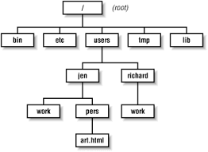

## Directories
Grouping of files is called directory. User logged in he will be in directory called home directory by name, it is /home/username.
Every user will have different home directory.
A directory can contain other directories and files.  You can type command
**pwd** stands for print working directory. If the response to **pwd** is **/home/username** let us understand each of it.
First **/** is a directory, its sub directory is home. **/home** meant / directory subdirectory **home** and its subdirectory is **username**

Q: If you type **ls** which directory files we are listing? We are listing current directory.
**ls /** prints list of files in the directory **/**

Note: If you don't give any option for the command line it picks current directory, otherwise it will take options from command line.

Q: cat filename prints contents of the file if it exists in the same directory. If file doesn't exist it will error out. Can you give multiple filenames?
Q: cat /etc/passwd file and see the contents. 
Q: cat /etc/passwd /etc/hosts /etc/resolv.conf what is the output?
Q: Why is it error for cat /etc/shadow

 - ls /usr /root  lists files in /usr and /root directories. You can give as many options as you wanted.
 
 You can imagine directories are listed as
                                /
    /home.   /usr    /bin  /sbin.  /local /dev. multiple subdirectories.
    Directories are inverted tree structure.
    ```


## Changing directory
If you wanted to create files, read the contents or execute you can always give complete path of the file.
'''
$cat /home/user/somedir/file100
$vi /home/user/dir1/file1

'''
It is inconvenient typing full path if you work most of the time in one directory. Here is simple way you can do.

'''
$mkdir chapter1.  # Create a directory
$cd chapter1. # go to it
$pwd    Make sure you are in the right place.

'''
.. refers to one level up in the file system and . refers to current directory.
cd always changes you your home directory. Home directory is the directory you get when you login.

$rm dirname will removes the directory. Before removing make sure you don't have files in that directory.
