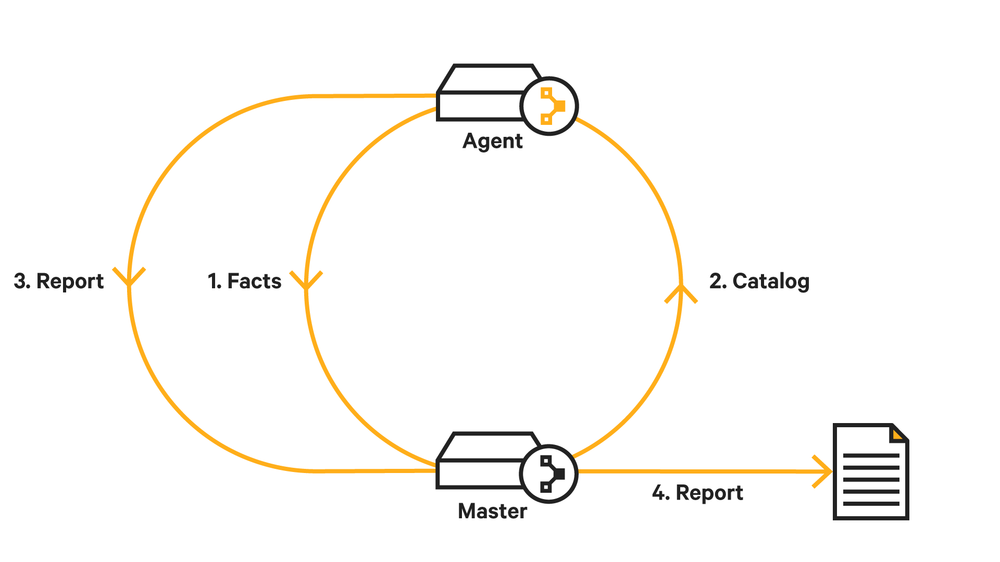
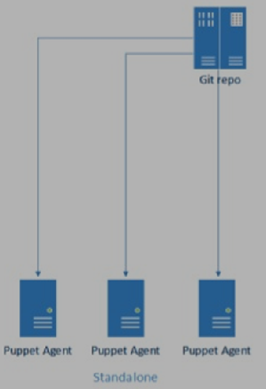

# Puppet (2 hr)

## Introduction

### a. Puppet Development History

Puppet is a configuration management tool released in 2005 by Luke Kanies. Puppet is first in its kind of tool set (like Chef or Ansible) and we can say it is revolutionized the DevOps world, prior to Puppet it is all about Shell scripts. Puppet is written in Ruby, with its free-software version released under the 2.0 (the GNU General Public License (GPL) until version 2.7.0). Puppet tool set "Facter" is written in C++ while Puppet Server and Puppet DB are written in Clojure. Pupet Enterprise released in 2011 is based on open source code base, though started as configuration management tools it is now includes provisioning, IT infrastructure life cycle, patching, configuration management.

Puppet follows a client-server model, wherein one machine in any cluster can act as a server, called the puppet master, and the other can act as a client, called the slave nodes. Puppet can manage any system from scratch, starting from its initial configuration till the end-of-life.

### b.  Basic Uses Cases
Puppet is used for installing software, configuration files, service enable/disable/start and firewall management overall brining a system to a desired state. You can use either as client/server or stand alone mode to configure end system.


#### Standalone mode
One of the most overlooked features in Puppet is the puppet executable. This allows you to both compile and apply actions locally, removing the complexity of running in client/server mode. This makes puppet a viable tool for application bootstrapping, even on one machine. Executing: #>puppet mymanifest.pp will apply the configuration from the local source file mymanifest.pp to the host itself. 

#### Client/Server mode
Client/server deployment is the most common and feature rich way to run Puppet. For any environments where multiple hosts need to be managed, client/server deployment is usually the way to go. This mode has two executables, puppetmasterd (server), and puppetd (client). Knowing the roles of these executables is important for understanding the differences between these three deployment practices.  Client gathers local facts about its system using facter.  Client initiates a request to the server requesting the latest version of its catalog(description of desired configuration state) Server compiles the configuration from source(manifests) into a catalog and returns it to the client.  Client applies the catalog, resulting in configuration changes, and sends the status to master.

#### Massively scalable deployments
This method avoids single point of failure of master, we can run multi master setup for puppet.

#### Puppet Terminology

Facter: Puppet master requires information about agent it is about to manage. OS, Version, IP etc information is gathered by agent. The tool which gathers this information is called facter.
Manifest: Puppet language files are called manifest with extension .pp.
Module: Module manages a specific task for agent, such as installing and configuring a piece of software like MySQL or PostgreSQL or nginx webserver. It is a way of abstraction similar to cpan modules for Perl or python modules.
Catalog: Puppet compiles manifests into a catalog, catalog is created for each agent.

Puppet code is declarative, meaning you describe what you wanted, similar to sql statements unlike python program. This is accomplished by Puppet Domain Specific Language or Puppet DSL. Puppet is idempotent meaning repeatedly apply code to guarantee a desired state on a system, with the assurance that you will get the same result every time.

### c. Architecture

**The agent-master architecture**
When set up as an agent-master architecture, a Puppet master server controls the configuration information, and each managed agent node requests its own configuration state from the master. Managed nodes runs the Puppet agent application, usually as a background service. One or more servers run the Puppet master application, Puppet Server.  

Puppet agent sends facts to the Puppet master, and requests a catalog. The master compiles and returns that node's catalog, using several sources of information it has access to.  
 Puppet agent applies catalog obtained from master to the node by checking each resource the catalog describes. If it finds any resources that are not in their desired state, it makes the changes necessary to correct them. Or, in no-op mode, it reports on what changes would have been done.  Agent sends a report to the Puppet master, after applying changes.
 


Communications and security
Puppet agent nodes and Puppet masters communicate by HTTPS with client verification. The Puppet master provides an HTTP interface, with various endpoints available. When requesting or submitting anything to the master, the agent makes an HTTPS request to one of those endpoints. Client-verified HTTPS means each master or agent must have an identifying SSL certificate. They each examine their certificate to decide whether to allow an exchange of information.  
Puppet includes a built-in certificate authority for managing certificates. Agents can automatically request certificates through the master's HTTP API. You can use the puppet cert command to inspect requests and sign new certificates. Agents can then download the signed certificates.


**The stand-alone architecture**
Puppet can run in a stand-alone architecture, where each managed node has its own complete copy of its configuration info and compiles its own catalog. Managed nodes run the Puppet apply application, as a scheduled task or cron job. You can also run it on demand for initial configuration of a server or for smaller configuration tasks. Puppet master application, Puppet apply needs access to several sources of configuration data, which it uses to compile a catalog for the node it is managing. Puppet apply stores a report on disk, one can configure it to send reports to a central service.




## 2. Functionality
Very high level puppet functionality can be described as

Client gathers local facts about its system using facter.
Client initiates a request to the server requesting the latest version of its desired configuration state also called catalog.
User writes client desired state in multiple files called manifests.
Server compiles the configuration from source(manifests) into a catalog and returns it to the client.
Client applies the catalog, resulting in configuration changes.

*The main constraint of the client/server model of Puppet is that the server is CPU bound on catalog compilations. This can limit the scale at which puppet can be run on a single Puppet masters. The limiting factors of scale are, number of hosts per Puppet server and interval between client check-ins.*


## 3. Components
Following are the key components of Puppet:

* Manifests
* Module
* Resource
* Factor
* M-collective
* Catalogs
* Class
* Nodes

**Manifests**

Agents configuration details are written in Ruby with extension of .pp. Configurations are described declaratively (Domain specific language or simply called DSL) about what packages needs to be installed, what files has to be copied etc. Manifests are stored in puppet server.

**Module**

The puppet module is a set of manifests and data, data is file, facts, or templates. The module follows a specific directory structure. These modules allow the puppet program to split into multiple manifests. Modules are self-contained bundles of data or code. 
Module is an abstraction of multiple manifests together. Standard modules are hosted in puppet forge site like installing MySQL/PostgreSQL or apache webserver.

**Resource**

Resources are a basic unit of system configuration modeling. These are the predefined functions that run at the backend to perform the necessary operations in the puppet. Each puppet resource defines certain elements of the system, such as some particular service or package.

**Facter**

The facter collects facts or important information about the puppet slave. Facts are the key-value data pair. It contains information about the node or the master machine. It represents a puppet client states such as operating system, network interface, IP address, uptime, and whether the client machine is virtual or not.

These facts are used for determining the present state of any agent. Changes on any target machine are made based on facts. Puppet's facts are predefined and customized.

**Catalogs**

Catalog is collection of all manifests that needs to be applied for a single slave host in compiled format. There are as many catalogs as the number of slaves.

**Class**

Like other programming languages, the puppet also supports a class to organize the code in a better way. Puppet class is a collection of various resources that are grouped into a single unit.

**Nodes**

The nodes are the location where the puppet slaves are installed used to manage all the clients and servers.

## 4. Language and Configuration Basics

Let us start with hello world example. We will write helloworld manifest file and apply it. Create a file called hello.pp with contents 

```
file {'/tmp/helloworld':
    content => “Hello World!\n”,
}
```

puppet apply manifest/hellofile.pp

Let us create the file with permissions 640

```
file {'/tmp/helloworld':
    content => “Hello World!\n”,
    mode => 0664,
}
```

We are managing files and permissions in the above examples, same way we can manage packages and many more. Let us list what are all we can manage

**$puppet  describe --list**

**A sample output looks like**

* group           - Manage groups
* host            - Installs and manages host entries
* mount           - Manages mounted filesystems, including puttin ...
* notify          - Sends an arbitrary message, specified as a st ...
* package         - Manage packages

We call file, group, host, package etc listed above are resources. We will try to understand about resources now. Let us go over few example resources.

```
user { 'Sam':
 ensure     => present,
 uid        => '900',
 gid        => '900',
 shell      => '/bin/bash',
 home       => '/home/sam'
}

service { 'mysql':
  ensure => 'running',
  enable => true,
}

package { 'openssh':
  ensure  => installed,
  name    => openssh,
}
```

We listed examples of file, user, service and package resource types. We didn't cover
how to make dependency or all options for each resource type, they will be covered in lab.

Resources are the building blocks of puppet. Each resource describes the desired state for some aspects of a system, such as service, file, and package. Resources in the puppet are aggregated together by using either "define" or "classes." This feature provides help in organizing a module.
Every resource declaration at least contains a resource type, a title, and a set of attributes.

Syntax:

```
<TYPE> { '<TITLE>':
<ATTRIBUTE> => <VALUE>, }

We can define variables for resource as
$package = "vim"    
package {  $package:   
   ensure => "installed"   
} 
```
Loops are used to run the same set of code multiple times until a defined condition becomes true. To perform the loop, we can use an array. Let's see an example:

```
$packages = ['vim', 'git', 'curl']    
  
package { $packages:   
   ensure => "installed"   
}  
```

Using Conditionals
Puppet allows us to use different types of conditional statements. Such as if-else statement, case statements, etc. Let's see an example:

```

if $Color != 'Grey' {   
   warning('This color is not good for wall')   
} else {   
   notify { 'This color is best for wall': }  
}  
```

Manifests
Resources are single block of code, manifests contain multiple resources together plus additional data. Manifests contain one or more resources, files, templates, nodes. We will take above resources examples and keep it in a file called manifest. 

`mysql.pp`

```
service { 'mysqlserver':
  ensure => 'running',
  enable => true,
}

package { 'mysqlserver':
  ensure  => installed,
  name    => mysqld,
}
```

There are two resources combined and created manifest, however there is a flaw in the above manifest. service mysql depends on package mysql installation but we didn't tell service depends on package, which we will write new manifest file as

mysql.pp

```
service { 'mysql':
  ensure => 'running',
  enable => true,
  require => Package['mysqlserver'],
}

package { 'mysqlserver':
  ensure  => installed,
  name    => mysqld,
}
```


**Puppet Modules**

Modules are the reusable and shareable units in the puppet. If you are familiar with Perl CPAN modules or Python modules Puppet modules are similar to them. Puppet modules are available for most of the standard software and hosted at puppet forge site. Puppet modules differ with manifests as a) Modules deal with only one task b) Module contains collection of files, classes, templates, and resources except nodes.

Modules are installed in puppet configuration file under puppetmasterd section

[puppetmasterd]   
...   
modulepath = /var/lib/puppet/modules:/data/puppet/modules  

Module Organization
When creating a new module in Puppet, it uses the same structure and adds distributed files, manifests, templates, and plugins organized in a specific directory structure, as given in the code below.

```
MODULE_PATH/   
   downcased_module_name/   
      files/   
      manifests/   
         init.pp   
      lib/   
         puppet/   
            parser/   
               functions   
            provider/   
            type/   
         facter/   
      templates/   
      README  
```

Once you create the module, it adds init.pp manifest file at a particular fix location in the manifest directory. init.pp is a default file that runs first in any module and includes a list of all classes related to that module.

Example
Let's see an example to create an autofs module that installs a fixed auto.homes map and generates the auto.master from templates:

```
class autofs {   
   package { autofs: ensure => latest }   
   service { autofs: ensure => running }   
     
   file { "/etc/auto.homes":   
      source => "puppet://$servername/modules/autofs/auto.homes"   
   }   
   file { "/etc/auto.master":   
      content => template("autofs/auto.master.erb")   
   }   
}  
```

The file system will have the following files:

```
* MODULE_PATH/   
* autofs/   
* manifests/   
* init.pp   
* files/   
* auto.homes   
* templates/   
* auto.master.erb  
```

Modules hosted in puppet forge can be installed in two ways, download module tar.gz file and run
puppet module install /path/dhoppe-vim-1.4.1.tar.gz  
or
puppet module install dhoppe-vim --version 1.4.1   


**Puppet File Server**

Puppet uses the client and server model where one system works as a server others are puppet agents. Multiple times we need to copy the files around several systems. This functionality of the Puppet file serving comes as part of the central Puppet daemon. Puppetmasterd and client functions are used to provide sourcing file attributes as the file object.

```
class { 'java':    
   package               => 'jdk-8u25-linux-x64',    
   java_alternative      => 'jdk1.8.0_25',    
   java_alternative_path => '/usr/java/jdk1.8.0_25/jre/bin/java'    
}  
```

In the above part of code, the file serving functions of Puppet abstract the topology of the local filesystem by supporting the module for file service. We will specify the file serving module in the following format:

Step 1: Create a directory that can be accessed by puppet and copy the files which needed to be exported to this directory.

Step 2: Create fileserver.conf and define directory and hosts that can access this directory.

We list some resources how we use puppet 

```
file { '/home/agile/apache.sh':  
     path => '/home/agile/apache.sh',  
     ensure => present,  
     mode => "755",  
     owner => agile,  
     source => "puppet:///scripts/apache.sh",  
  }  
  
file { "/usr/local/httpd-2.2.22.tar.gz":  
      path => "/usr/local/httpd-2.2.22.tar.gz",  
      ensure => present,  
      owner => agile,  
      group => agile,  
      source => "puppet:///packages/httpd-2.2.22.tar.gz",  
 }  
```

**Puppet Classes**

Puppet classes are the set of puppet resources that are grouped together as a single unit. Classes are used to model the fundamental aspects of the node. Puppet uses classes to make the structure reusable and organized. Classes can only be evaluated once per node. Classes are described within the manifest file, located inside Puppet modules. The main reason for using a class is to decrease the duplication of the same code inside any manifest file or other puppet code.


**Defining a Class**

Before using a class, we have to define it, which is done by the class keyword, the name of the class, curly braces, and a set of code. This part of the code does not automatically evaluate the code.

Syntax:

```
class my_class {  
  ... puppet code ...  
}  
```

**Declaring a Class**

The declaration part of a class evaluates the code in the class and applies all its resources. This part of the code actually does something.

Syntax:

```
class my_class {  
  ... puppet code ...  
}  
include my_class  

class unix {   
   file {   
      '/etc/passwd':   
      owner => 'superuser',   
      group => 'superuser',   
      mode => 644;   
      '/etc/shadow':   
      owner => 'nikita',   
      group => 'nikita',   
      mode => 440;   
   }   
}  
```

Let's see another simple example which is similar to the above example:

```
class unix {   
   file {   
      '/etc/passwd':   
      owner => 'superuser',   
      group => 'superuser',   
      mode => 644;   
   }    
     
   file {'/etc/shadow':   
      owner => 'nikita',   
      group => 'nikita',   
      mode => 440;   
   }   
}  
```

Parameterized Class
Parameters are used to allow a class to request external data. If a class has to configure itself to data other than facts, the data will typically be inserted by a parameter into the class.

Let's see one example:

```
class windows_ntp (    
  String $server = 'time.windows.com',  
) {   
  registry::value { 'NtpServer':  
    key  => 'HKEY_LOCAL_MACHINE\SYSTEM\CurrentControlSet\Services\W32Time\Parameters',  
    data => "${server},0x9",  
  }  
  service { 'w32time':  
    ensure => running,  
    enable => true,  
  }  
}  
```

In the above example, we created a class windows_ntp, which grouped together a registry resource and a service resource to configure the Windows time service. windows_ntp class accepts the time server address as a parameter named $server.


## Lab - Puppet

## Summary

**After completing this module, you will be able to do the following:**

## Glossary

## References
